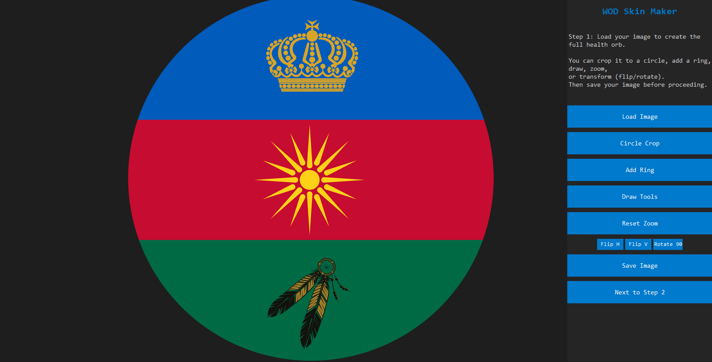
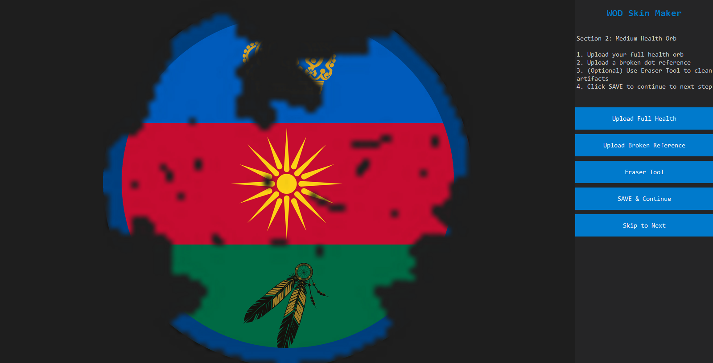
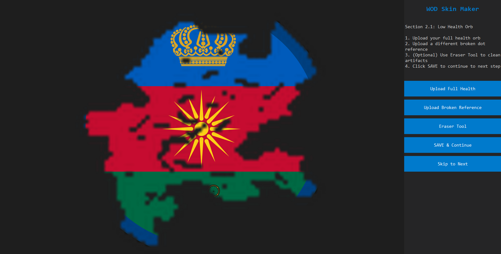

# WOD Skin Maker

This guide explains how to create custom **health orb skins** for *War of Dots* using the WOD Skin Maker.

The process is divided into clear sections, starting from a base orb and ending with finalized in-game assets.

---

## Section 1: Base Dot / 100% dot



This step is where you create your **base dot**, which will be used to generate all other sizes later.

- Do **not** worry about final size yet  the image will be resized in later steps.
- It is **strongly recommended** that your base image is **256×256 pixels**.
  - Using higher resolutions may result in **quality loss** when scaling down.

### Steps
1. Click **Load Image** to import your base design.
2. If needed, use **Circle Crop** to crop the image into a circular shape.
3. Once cropping is complete, click **Add Ring**.
   - Do not make the ring too thick.
   - Recommended ring thickness: **16–18 pixels**.
4. When finished, save the image and proceed to the next step.

This base dot serves as the foundation for all scaled health orbs.

---

## Section 2: Medium Health Orb (50%)



In this step, you create the **medium (50%) health orb** using your previously saved full health orb.

### Steps
1. Upload your **full health orb (100%)**.
2. Upload a **broken dot reference**.
   - The default location is usually:
     ```
     C:\Users\<username>\AppData\Local\War of Dots\assets\skins
     ```
   - This path may differ depending on your system.
3. Select the broken dot reference you want to use.
   - The image will load automatically.
4. If you see **black or white lines**, do not panic.
   - Use the **Eraser Tool** to clean up visual artifacts.
5. Click **Save** to continue.

### Naming Convention
Save the file as:
- `inf2_nameofskin`
- `tank2_nameofskin`

This file represents the **50% health state**.

---

## Section 2.1: Low Health Orb (25%)



This step follows the **same process as Section 2**, but creates the **low (25%) health orb** using a **different broken dot reference**.

### Steps
1. Upload your **full health orb (100%)**.
2. Upload a **different broken dot reference** than the one used for the medium orb.
3. (Optional) Use the **Eraser Tool** to clean up any artifacts.
4. Click **Save** to continue.

### Naming Convention
Save the file as:
- `inf1_nameofskin`
- `tank1_nameofskin`

This represents the **lowest health state** and should appear more damaged than the medium orb.

---

## Section 2.2: Resize to In Game Size


This step prepares the **final full health orb** for in-game use.

### Steps
1. Upload your **full health orb (100%)**.
2. Resize the image to **200×200 pixels**, which is the required in game size.
3. Ensure the image remains centered and properly aligned.
4. Click **Save** to finalize.

### Naming Convention
Save the file as:
- `inf_nameofskin`
- `tank_nameofskin`

This file is used as the **main in-game health orb**.

---

## End


You have now completed the full health orb creation workflow.

You should now have:
- A **full health orb** (200×200)
- A **medium health orb** (50%)
- A **low health orb** (25%)

### What to do next
- create you tank skins

---
